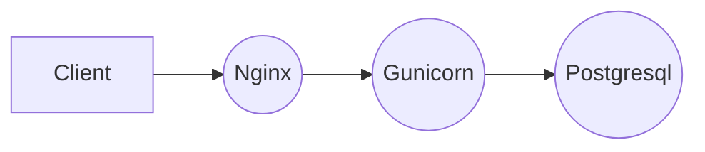
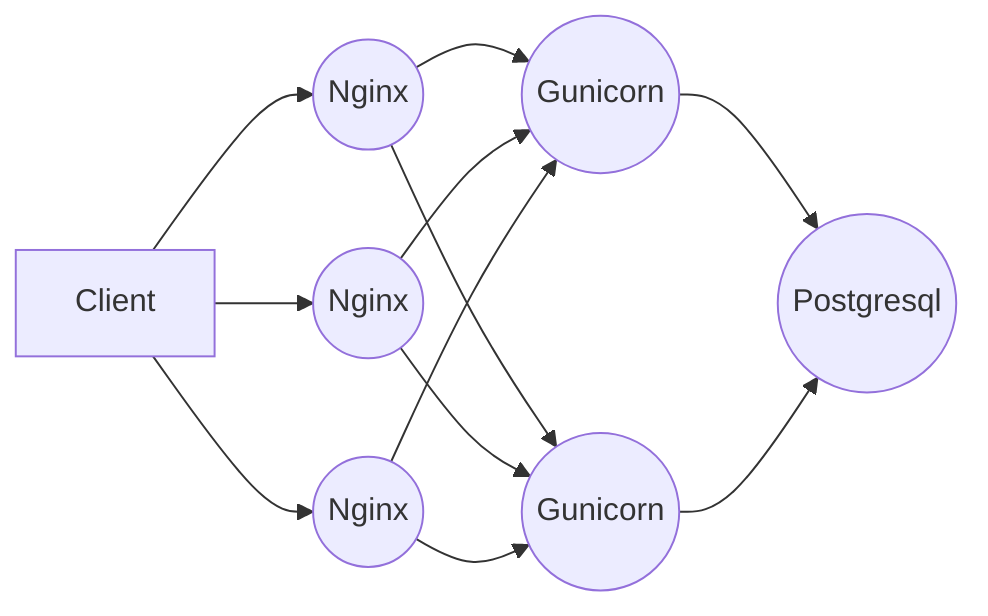

# Conding Game

  

El siguiente ejemplo fue un desafio provisto por Coding Game

  

## Uso

  

Para Generar los tests de forma manual puede ejecutar el workflow de [Unit Test](https://github.com/bmaluff/coding-game/actions/workflows/unit_test.yaml) o [Coverage Test](https://github.com/bmaluff/coding-game/actions/workflows/coverage_test.yaml), ambos subirán los resultados de los test en formato txt como artifacts, los cuáles pueden ser accedidos a través de la [API de GitHub](https://docs.github.com/en/rest/actions/artifacts?apiVersion=2022-11-28)

  

Para construir y subir a Docker Hub ejecute el workflow [Push Production](https://github.com/bmaluff/coding-game/actions/workflows/push_production.yaml). Los datos requeridos son:

 1. Repositorio público en Docker Hub
 2. Usuario de Docker
 3. Token de Docker
 

Para ejecutar todos los workflow anteriores ejecute el workflow [Main](https://github.com/bmaluff/coding-game/actions/workflows/main.yaml) agregando los datos requeridos para el workflow Push Production

## Vista General de la versión en producción
A diferencia del proyecto original basado en Django que corre con su servidor web empotrado la versión en producción separa los componentes para hacerlo más escalable y resiliente.

De esta forma podemos escalarlo con un orquestador como **Kubernetes** de la siguiente manera

## Despliegue con Kubernetes
La versión de producción de la aplicación puede ser desplegada usando Kubernetes en el entorno local
### Pre-requisitos
Antes de clonar el repositorio asegúrese de contar con los siguientes programas:
1. Docker ([Como Instalar Docker](https://docs.docker.com/engine/install/))
2. Kubectl ([Como Instalar Kubectl](https://kubernetes.io/docs/tasks/tools/))
3. Minikube ([Como Instalar Minikube](https://minikube.sigs.k8s.io/docs/start/))
### Uso
Para probar el despliegue con Kubernetes de forma local siga los siguientes pasos:
1. Clone el repositorio `git clone https://github.com/bmaluff/coding-game.git`
2. Ejecute el script `sh pipeline.sh` desde su terminal
3. Abra la aplicación desde su navegador con la URL [http://localhost:8080/api/](http://localhost:8080/api)
4. Para terminar la ejecución simplemente presione desde la terminal `Ctrl + c`
## Despliegue con Terraform
Para desplegar la aplicación en la nube se utilizó Terraform como herramienta de IaC y como proveedor a AWS.
### Pre-requisitos
Para el despliegue de la aplicación con Terraform deberá contar con lo siguiente:
1. Cuenta de AWS con permisos adecuados para el provisionamiento de los recursos
2. 